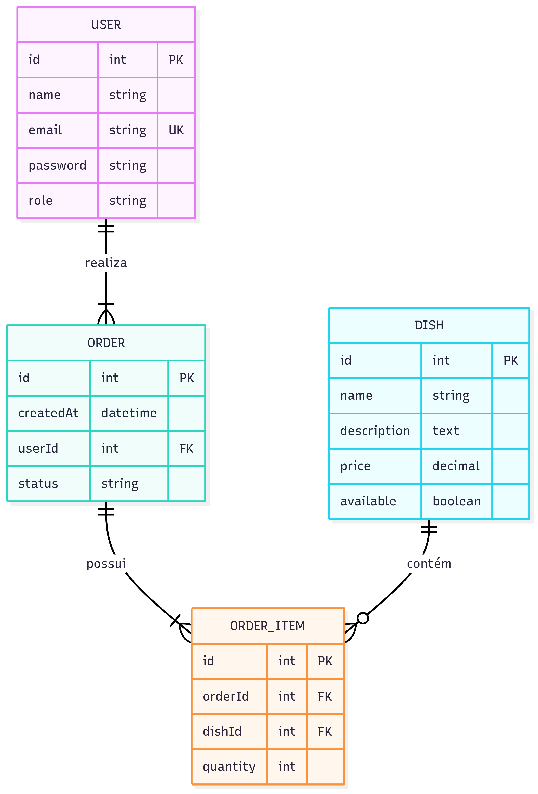
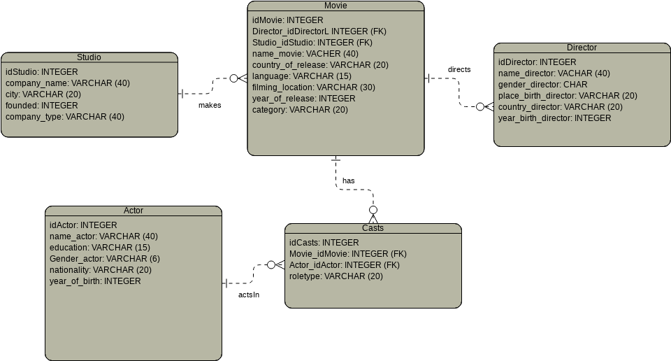
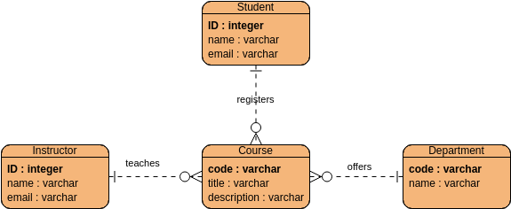

# 🛠️ Atividade Complementar – Do Conceito à Prática

## 🎯 Objetivo

Transformar diagramas de Entidade-Relacionamento (DER) em código SQL, criando bancos de dados completos no MySQL a partir de modelos conceituais.

## Diagramas

### Restaurante

### Filmes

### Estudantes

## 📝 Instruções

1. Para cada diagrama:

   * Crie um **banco de dados** separado no MySQL.
   * Crie **todas as tabelas, colunas, chaves primárias e estrangeiras** conforme o modelo.
    
2. Após finalizar:

   * Salve os códigos SQL em arquivos separados (`der1.sql`, `der2.sql`, `der3.sql`).
   * Coloque todos os arquivos em **uma pasta** e compacte em `.zip`.
   * Envie o `.zip` no [fórum de discussão](https://github.com/dhDSouza/UC3_PSG25-1T/discussions/7) aberto.

## ⚠️ Regras

* Utilize **nomes de tabelas e colunas iguais aos do DER** (ou o mais próximo possível).
* Utilize corretamente os **tipos de dados** (ex.: `VARCHAR`, `INT`, `DATE`...).
* Lembre-se de criar **relacionamentos com `FOREIGN KEY`**.

## ✅ Entrega

* Arquivo final: `atividade_complementar.zip`
* Prazo: `31/07/2025`
