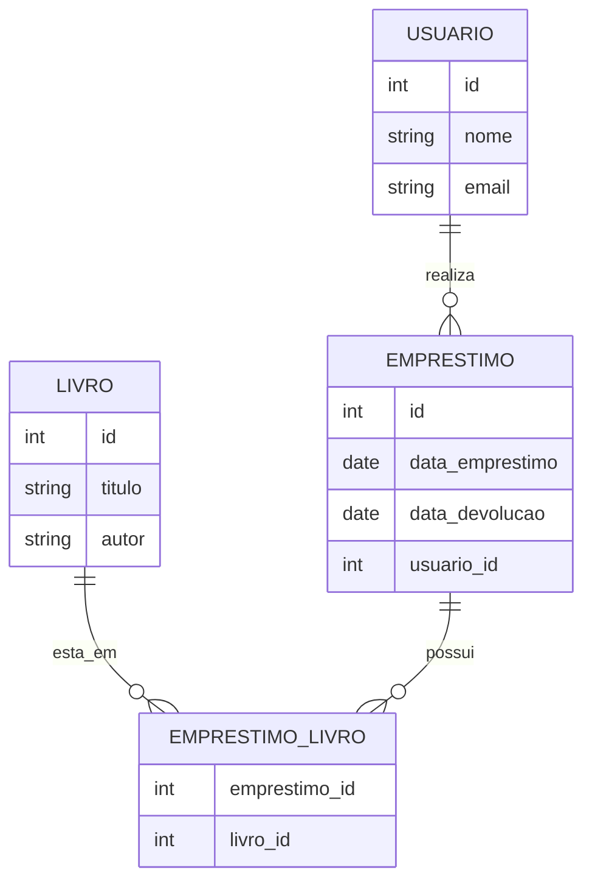

# 📘 **Aula 2: Modelagem Conceitual com Diagrama ER**

## 🧠 O que é a Modelagem Conceitual?

Antes de montar tabelas no banco, precisamos **entender o mundo real** que queremos representar com dados. É isso que a modelagem conceitual faz!

📐 É como fazer a **planta baixa de uma casa** antes de construir: ela mostra o que vai existir (entidades), quais são as características (atributos) e como as coisas se conectam (relacionamentos).

---

## 🧱 Conceitos Básicos

### 📦 Entidade

* É **algo do mundo real** que queremos armazenar.
* Exemplos: Cliente, Produto, Funcionário, Livro...

### 🏷️ Atributo

* É uma **característica** de uma entidade.
* Ex: nome, data de nascimento, CPF...

### 🔗 Relacionamento

* Representa a **ligação entre duas ou mais entidades**.
* Ex: um aluno **matricula-se** em um curso.

---

## 🧠 Exemplos de Entidades e Atributos

| Entidade | Atributos                  |
| -------- | -------------------------- |
| Cliente  | id, nome, cpf, email       |
| Produto  | id, nome, preço            |
| Pedido   | id, data, valor\_total     |
| Aluno    | id, nome, data\_nascimento |

---

## 🔢 Tipos de Relacionamento

| Tipo  | Exemplo           |
| ----- | ----------------- |
| 1 : 1 | Pessoa → CPF      |
| 1 : N | Cliente → Pedidos |
| N : N | Aluno → Curso     |

🧩 Relacionamento N\:N geralmente vira uma **tabela intermediária** no futuro.

---

## 🔧 Exemplo Prático: Sistema de Biblioteca

Vamos modelar um sistema simples de biblioteca:

* **Livro** (id, título, autor)
* **Usuário** (id, nome, email)
* **Empréstimo** (id, data\_emprestimo, data\_devolucao)

Relacionamentos:

* Um **usuário** pode fazer **vários empréstimos** (1\:N)
* Um **empréstimo** pode ter **vários livros** e um livro pode estar em **vários empréstimos** (N\:N)

---

## 🗺️ Diagrama ER com Mermaid

---

## 🧰 Ferramentas para Criar Diagramas

Você pode usar:

* [BRModelo Web](https://github.com/kevinrpb/brmodelo-web)
* [dbdiagram.io](https://dbdiagram.io)
* [Draw.io (diagrams.net)](https://app.diagrams.net)

Ou até mesmo o **Mermaid** (como mostrado acima)!

---

# ✅ Exercícios da Aula

### 📓 Teóricos

1. O que é uma entidade e um atributo? Dê exemplos.
2. Qual a diferença entre um relacionamento 1\:N e N\:N?

### 🧩 Práticos

3. Modele o **Diagrama ER** para um sistema de **locadora de filmes** com as seguintes entidades:

* **Cliente** (id, nome, cpf)
* **Filme** (id, nome, categoria)
* **Locação** (id, data, valor)

Relacionamentos:

* Um cliente pode fazer várias locações (1\:N)
* Uma locação pode conter vários filmes e um filme pode estar em várias locações (N\:N)

🔁 Use BRModelo, dbdiagram ou outro para desenhar.

---

## 🎯 Tarefa para a Próxima Aula

🎒 Escolha um tema de sistema simples (ex: escola, pizzaria, clínica) e:

* Modele o **Diagrama ER** com no mínimo **3 entidades**
* Use relacionamentos 1\:N ou N\:N
* Traga o modelo para a próxima aula (vamos transformar isso em modelo lógico! 👨‍💻)
