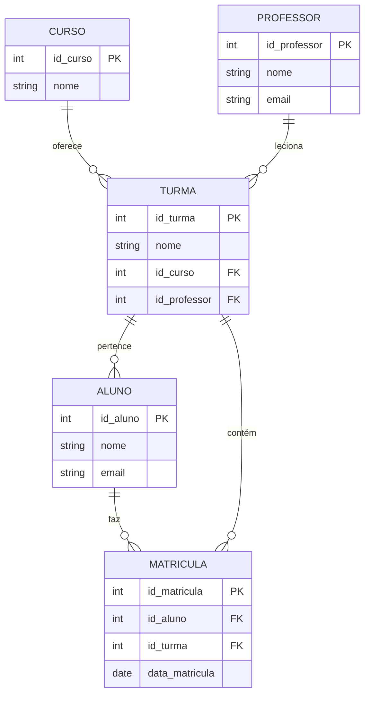

# 💾 **Aula: Introdução a Banco de Dados Relacional**

## 🎯 Objetivos da Aula

* Compreender o papel de um banco de dados em aplicações reais.
* Diferenciar modelo conceitual, lógico e físico.
* Aprender a construir o modelo lógico (MER e Tabelas).
* Entender os principais **tipos de dados** e **atributos**.
* Aplicar os conhecimentos na prática com **SQL (DDL e DML)**.

---

## 🧠 O que é um Banco de Dados?

Um **banco de dados** é uma coleção organizada de dados que podem ser facilmente acessados, gerenciados e atualizados. Em sistemas reais, eles são usados para guardar informações como:

* Dados de usuários em apps 💬
* Produtos de um e-commerce 🛒
* Notas e presenças de alunos em um sistema escolar 🎓

---

## 🧱 Etapas da Modelagem de Dados

1. **Modelo Conceitual (MER - Diagrama Entidade Relacionamento)**

   * Sem preocupação com SGBD.
   * É a visão mais próxima da realidade do problema.
   * Usa entidades, relacionamentos e atributos.

2. **Modelo Lógico**

   * Conversão do MER em tabelas.
   * Ajustes de chaves primárias/estrangeiras, tipos de dados e relacionamentos.

3. **Modelo Físico / SQL**

   * Implementação no banco (MySQL, PostgreSQL...).
   * Utiliza comandos SQL (DDL/DML).

---

## 🧑‍🏫 Cenário de Exemplo: Sistema Escolar

Vamos modelar um sistema simples para gerenciar cursos, turmas, alunos e professores.

---

## 🔷 Modelo Conceitual (MER)



---

## 🧾 Modelo Lógico (Tabelas)

| Tabela    | Colunas                                                                 |
| --------- | ----------------------------------------------------------------------- |
| CURSO     | `id_curso (PK)`, `nome`                                                 |
| PROFESSOR | `id_professor (PK)`, `nome`, `email`                                    |
| TURMA     | `id_turma (PK)`, `nome`, `id_curso (FK)`, `id_professor (FK)`           |
| ALUNO     | `id_aluno (PK)`, `nome`, `email`                                        |
| MATRICULA | `id_matricula (PK)`, `id_aluno (FK)`, `id_turma (FK)`, `data_matricula` |

---

## 🔡 Tipos de Dados em SQL

| Tipo de Dados | Descrição |
|:-------------:|-----------|
| **INT**       | Número inteiro (4 bytes). Pode ser especificado como `TINYINT`, `SMALLINT`, `MEDIUMINT`, `INT`, ou `BIGINT` para diferentes tamanhos. |
| **FLOAT**     | Número de ponto flutuante com precisão simples. |
| **DOUBLE**    | Número de ponto flutuante com precisão dupla. |
| **DECIMAL**   | Número decimal com precisão exata, útil para valores monetários. |
| **CHAR**      | Cadeia de caracteres com comprimento fixo. |
| **VARCHAR**   | Cadeia de caracteres com comprimento variável. |
| **TEXT**      | Cadeia de caracteres de comprimento variável, até 65.535 caracteres. Existem variantes menores: `TINYTEXT`, `MEDIUMTEXT`, `LONGTEXT`. |
| **DATE**      | Data no formato 'YYYY-MM-DD'. |
| **DATETIME**  | Data e hora no formato 'YYYY-MM-DD HH:MM:SS'. |
| **TIMESTAMP** | Data e hora no formato 'YYYY-MM-DD HH:MM:SS', geralmente usado para registros de criação e atualização. |
| **TIME**      | Hora no formato 'HH:MM:SS'. |
| **YEAR**      | Ano no formato 'YYYY'. |
| **BLOB**      | Binário Large Object, usado para armazenar dados binários de até 65.535 bytes. Variedades incluem `TINYBLOB`, `MEDIUMBLOB`, `LONGBLOB`. |
| **ENUM**      | Lista de valores permitidos, armazenando uma string de uma lista de valores predefinidos. |

---

## 🧩 Tipos de Atributos

| Atributo       | Descrição |
|:--------------:|-----------|
| **NOT NULL**   | Garante que a coluna não pode ter valores nulos. |
| **AUTO_INCREMENT** | Incrementa automaticamente o valor da coluna para cada nova linha, geralmente usado para chaves primárias. |
| **PRIMARY KEY** | Define a coluna como a chave primária da tabela, garantindo unicidade e indexação. |
| **FOREIGN KEY** | Estabelece uma relação entre colunas de tabelas diferentes, garantindo integridade referencial. |
| **UNIQUE**     | Garante que todos os valores na coluna sejam únicos. |
| **DEFAULT**    | Define um valor padrão para a coluna quando nenhum valor é fornecido. |
| **CHECK**      | Define uma restrição que limita os valores aceitos na coluna (disponível a partir do MySQL 8.0.16). |

---

## 🧪 Mãos na Massa: Criando Tabelas em SQL

```sql
CREATE TABLE curso (
  id_curso INT PRIMARY KEY AUTO_INCREMENT,
  nome VARCHAR(100) NOT NULL
);

CREATE TABLE professor (
  id_professor INT PRIMARY KEY AUTO_INCREMENT,
  nome VARCHAR(100) NOT NULL,
  email VARCHAR(100) UNIQUE NOT NULL
);

CREATE TABLE turma (
  id_turma INT PRIMARY KEY AUTO_INCREMENT,
  nome VARCHAR(100) NOT NULL,
  id_curso INT,
  id_professor INT,
  FOREIGN KEY (id_curso) REFERENCES curso(id_curso),
  FOREIGN KEY (id_professor) REFERENCES professor(id_professor)
);

CREATE TABLE aluno (
  id_aluno INT PRIMARY KEY AUTO_INCREMENT,
  nome VARCHAR(100) NOT NULL,
  email VARCHAR(100) UNIQUE NOT NULL
);

CREATE TABLE matricula (
  id_matricula INT PRIMARY KEY AUTO_INCREMENT,
  id_aluno INT,
  id_turma INT,
  data_matricula DATE,
  FOREIGN KEY (id_aluno) REFERENCES aluno(id_aluno),
  FOREIGN KEY (id_turma) REFERENCES turma(id_turma)
);
```

---

## 🧯 Cuidados Comuns

* Sempre defina **chaves primárias** para garantir unicidade.
* Use **foreign keys** para garantir integridade referencial 🔗.
* Utilize os **tipos de dados adequados** para otimizar armazenamento e performance.

---

## 🏁 Atividade Proposta

1. Crie um MER no papel ou no MySQL Workbench com um cenário diferente (por exemplo: Biblioteca 📚, Clínica 🏥, Lancheria 🍔).
2. Converta para modelo lógico com tabelas.
3. Implemente no MySQL.
